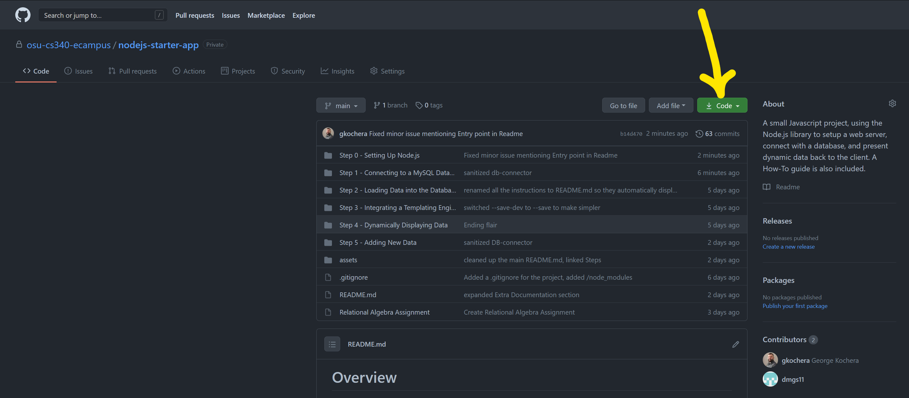
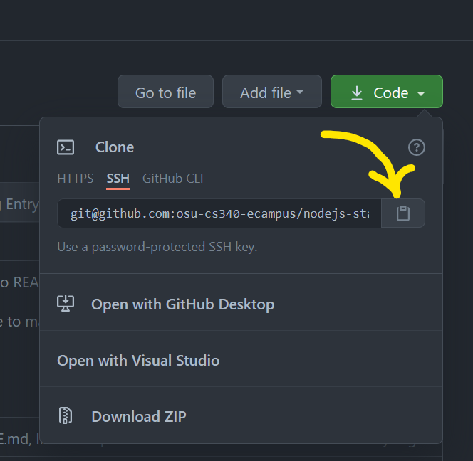

# Overview

This guide is intended for the students in CS 340 who want to take a path through the class using Node.js and Javascript.

This guide walks through everything from getting the tools setup to work on the app, setting up the infrastructure required to build and run your app, and building and (eventually) deploying the app either to OSU's flip server or Heroku.

There are a few assumptions that are made when this guide is written:

- You have basic familiarity with Javascript and MySQL syntax
- You are capable of opening a terminal and navigating using basic commands like `cd`, `ls`, etc.
- You have access to OSU's flip servers, and have been issued a MySQL database in class. 
    - This guide can be easily adapted for development on your local machine if you are so inclined.

## Contributions

Dr. Curry and Prof. Safonte for allowing me the time to build the guide and project for other students to benefit from.

## Clone and Go

You can clone the entire repository to a directory on your Flip Server account. The how-to is broken up into separate folders, complete with code and their own README.txt allowing you hit the ground running.

Whenever the Step requires database interactivity, you will need to load your own credentials in `database/db-connector.js` for that Step. You'll note for each step, the login, database and password are set to `'*'`. 

# Table of Contents

- [Overview](#overview)
  - [Contributions](#contributions)
  - [Clone and Go](#clone-and-go)
- [Table of Contents](#table-of-contents)
- [Get The Tools Downloaded You Will Need](#step-1---get-the-tools-downloaded-you-will-need)
  - [Text Editior](#text-editior)
  - [Browser](#browser)
  - [Terminal Application](#terminal-application)
  - [Git](#git)
    - [Create a .gitignore File](#create-a-.gitignore-file)
  - [More on Git](#more-on-git)
- [Step 0 - Setting Up Node.js](/Step%200%20-%20Setting%20Up%20Node.js/)
- [Step 1 - Connecting to a MySQL Database](/Step%201%20-%20Connecting%20to%20a%20MySQL%20Database/)
- [Step 2 - Loading Data into the Database](/Step%202%20-%20Loading%20Data%20into%20the%20Database/)
- [Step 3 - Integrating a Templating Engine (Handlebars)](/Step%203%20-%20Integrating%20a%20Templating%20Engine%20(Handlebars)/)
- [Step 4 - Dynamically Displaying Data](/Step%204%20-%20Dynamically%20Displaying%20Data/)
- [Step 5 - Adding New Data](/Step%205%20-%20Adding%20New%20Data/)
- [Extra Documentation](#extra-documentation)

# Get The Tools Downloaded You Will Need

You are going to need a few things get going here.

## Text Editior

Text Editors are like clothes. Everyone has their preferences. I prefer VS Code so this guide will be built using that editor. You can use what you please. Atom, Sublime, Notepad, Vim, eMacs or even Notepad are completely acceptable. We just need to be able to edit our code.

## Browser

Personally, I am a Firefox user. This guide will be using Firefox, but Chrome is also acceptable. I'm not familiar with Edge, but if you are, you can certainly give it a whirl also. Just be familiar with opening your developer console. On Firefox, its the F12 key.

Mac crowd: Safari *usually* is fine. If you have issues though, I would recommend switching to Firefox or Chrome. Safari has some quirks when it comes to rendering CSS, though admittedly over the past few years it has gotten better.

## Terminal Application

You will need some way to interface with the Flip Server and SSH into it. My preferred method is to use VS Code to directly connect to the Flip. Once connected, I can open a VS Code terminal and enter the native linux commands there. As long as you can SSH into a Flip, enter commands, you are all set.

You may prefer Putty or xterm. Those are fine, you should be capable of establishing an SSH session to the flip server using whatever tool you choose. Mac users, can use their built in terminal. 

Windows 10 users, I'll take this opportunity to make the suggestion of considering installing the Windows Subsystem for Linux 2. It let's you run a native Linux installation right on top of Windows 10. I learned how to install it and use back when I first started the program in Fall 2019. I'll never go back. 

[Learn How To Install WSL2 on Windows 10](https://docs.microsoft.com/en-us/windows/wsl/install-win10)

## Git

I strongly believe in using Version Control. Why?

- It keeps a record of your work.
- It allows you to go back to an older state of the project if you made a mistake.
- You can push it to a Private or Public GitHub repository (always assume Private unless you check with your instructor first)
- It makes working on the same project on different computers a breeze.
- It can support your case if you are ever scrutinized for academic dishonesty. (Having a paper trail of commits you can show the school)
- If your computer fails, your data is not lost.
- It integrates quite easily with other third party services such as Heroku.

This is a Portfolio Project. It will be yours to demo to prospective employers or show of to friends and family. Log in to GitHub, make a new repo, check the option to create a README.md file, and create!

In GitHub, when you are on your repo's homepage, you will see a green button that says code, click it and then ensure you copy your appropriate repo link.

> You might notice the options HTTPS, SSH and GitHub CLI above the text. Most users will want to use HTTPS. This will prompt you for a UserName and Password when pushing to the repo. If you don't want to do that every single time, I highly recommend learning how to interface with GitHub using SSH. It only takes a few minutes, and the upside is, you never have to type in your Username and Password. It's how I do it and I've never looked back.
>
> Here is a link for those interested: [Connecting to GitHub with SSH](https://docs.github.com/en/free-pro-team@latest/github/authenticating-to-github/connecting-to-github-with-ssh)




Once you have created a new repo and got your link, fire up your terminal. Navigate to a place where you want to clone your repo to. Cloning creates a new folder (named the same as the repo) so no need to create a new folder just to clone it to. Enter the following command:

```bash
git clone <link_you_copied_from_GitHub>
```

You can then check to see that the clone was successful by typing the following command in your terminal.

```bash
ls
```

You should see whatever was in the folder before AND a new folder with the same name as your repo.


You can now navigate to the folder by:

```cd <name_of_your_new_folder>```

You will now be in your new folder created by cloning the repo. **This would be the root of your new project.**


> Your terminal prompt is likely to look a bit different than what you see in these images. I have customized mine. The commands on your terminal will still yield the same output, they just might be different colors or fonts.

> This example provides pictures that have an already populated database. You will only see a README.md file in your project.

### Create a .gitignore File

There are going to be certain things we don't want to submit to our repo, such as credentials, the `/node_modules/` folder, etc.

Create a file called `.gitignore` in the root of your directory.

You can add individual paths, files and folders on a line by line basis in this file. Git will ignore each of those paths, files or folders when keeping track of your repo. For VS Code users, there is almost always a folder called `.vscode` that gets created in your project root. We will also be using Node Package Manager which will create a gargantuan folder called `node_modules`, which we don't want to keep in the repo. You can add the lines:

```bash
/.vscode
/node_modules
```

## More on Git

In short, your Git workflow should look something like this. 

1. Do a little bit of work
2. `git add` run in the command line from the root of your project
3. `git commit -m 'a message here containing a brief description of what you did'`
4. Do a little bit more work...
5. Repeat steps 2 through 4...
6. When you're done working for awhile (end-of-day, need to work on something different)...
7. Make sure you have added and committed everything already (you can run `git status` to verify that you have nothing to commit, it will tell you)
8. `git push`
9. Done!

When you are about to start working on your project, from the root of your project in the command line:

1. Get ready to work, run `git fetch`
2. `git pull`
3. Ready to work, go to the previous steps 1-9 while working...

Keep in mind that if you are working with multiple people on a project, you might want to learn about how to use branches, and submit pull requests. These are concepts that are tought in CS362, but have immense utility in any form of group work.

Again, using Git can really help you, or even save you. Check out [Git - The Simple Guide](https://rogerdudler.github.io/git-guide/) for the absolute barebones basics to understand git commands, what they do, and how they can help you.

# Extra Documentation

Believe it or not, these resources will yield you dividends if you spend time finding answers here. Many of the function calls and other things done in this guide can be found here. You can also find a variety of other features when browsing the docs and implement them in your own projects.

- [ExpressJS API Documentation](https://expressjs.com/en/4x/api.html)
- [HandlebarsJS Language Guide](https://handlebarsjs.com/guide/)
- [Git - The Simple Guide](https://rogerdudler.github.io/git-guide/)
- [Node.js 14 API Documentation](https://nodejs.org/dist/latest-v14.x/docs/api/)