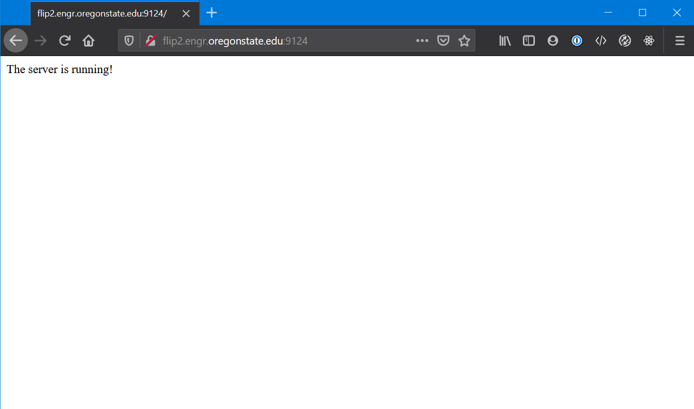

# Node.js - Step 0 - Getting a Server Running
This is the bare minimum you need to get running with Node.js. This will get you a server that can accept web requests and will return an output.

## Initialize your Project

Starting in your empty folder where you will begin building your project run the following command in your terminal:

```bash
npm init
```

This will create the `package.json` file that allows you to easily keep your imported libraries for the project up-to-date as well as share your project with other people (and later deploy your project) without constantly sharing the eggregiously large `/node_modules` folder.

## Install Express

Ok, now we have to install express, since, that is what we will be using as a server engine. Don't read too much into this step at first. We will talk more about it in later steps. From the prompt, in the root of your project, run:

```bash
npm i express --save-dev
```

`i` just means install. `--save-dev` will make sure the fact we installed this dependency gets added to our `package.json`. If you don't want to be constantly uploading, downloading, zipping and sending giant `node_modules` folders in your project, then you need to make sure you always install new packages with the `--save-dev` option.

## App.js

Our `app.js` is broken into three pieces at the very start. We have our SETUP, ROUTES, and LISTENER sections.

The SETUP neatly contains all of the variables we will need to effectively run the server and handle data. We will add things to
this part of the project regularly.

The ROUTES section contains every single path the server will respond to. Imagine the server is running on `flip1.engr.oregonstate.edu:9123`,
I could open my browser while connected to the OSU VPN, and navigate to `http://flip1.engr.oregonstate.edu:9123/` and get the desired output.
The ROUTES section define the path after the host name such as `flip1.engr.oregonstate.edu:9123`. `'/'` is considered the **root** route.

The LISTENER section is what actually makes the server *work*. Without this, the server won't, well, listen. We need to make sure it is given the PORT we want it to listen on. 

```javascript
// App.js

/*
    SETUP
*/
var express = require('express');   // We are using the express library for the web server
var app     = express();            // We need to instantiate an express object to interact with the server in our code
PORT        = 9124;                 // Set a port number at the top so it's easy to change in the future

/*
    ROUTES
*/
app.get('/', function(req, res)                 // This is the basic syntax for what is called a 'route'
    {
        res.send("The server is running!")      // This function literally sends the string "The server is running!" to the computer
    });                                         // requesting the web site.

/*
    LISTENER
*/
app.listen(PORT, function(){            // This is the basic syntax for what is called the 'listener' which receives incoming requests on the specified PORT.
    console.log('Express started on http://localhost:' + PORT + '; press Ctrl-C to terminate.')
});
```

# Running Step 0

Once you have completed the above three steps, navigate to the root of your project in your terminal, and run the command `node app.js`. You should see the following output in the terminal:


We can now open a browser.

If you are following along on a flip, type `hostname` in at the prompt and it will tell you what server you are currently developing your project on.


Navigate to `http://flipX.engr.oregonstate.edu:port`. Replace `X` with the flip number we got from `hostname`. In our case, we replace `X` with `2`. Replace `port` with the value you set `PORT` to in `app.js`. In our case it's `9124`.

Otherwise, if you are following along on your computer locally, just navigate to `http://localhost:port` setting port the same way as stated in the previous paragraph.

The end result will be a string of text in the browser saying "The server is running!":


