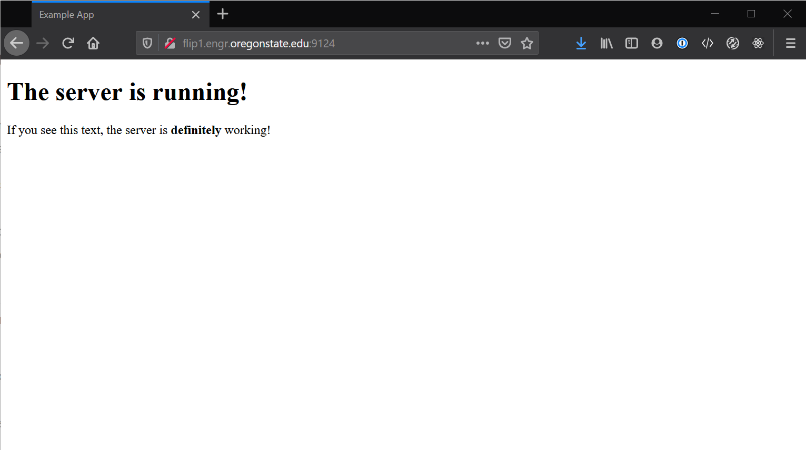

# Node.js - Step 3 - Integrating a Templating Engine (Handlebars)

This is a huge section. We are moving from sending single string responses to the client when the navigate to our page, to building the page on-the-fly and sending the built page to the client. This process allows you to create pages which contain data that is more meaningful to the client.

# Handlebars

Handlebars is a templating engine. What does that mean? 

In the most simplest form, a template is a base design which you use to create a finished product. Think about when you were a young child, and you had those little plastic templates with letters in them you could just put a marker and trace within the cutout, when you remove the template, you had a pretty great looking letter.

A templating engine is simply a piece of software that handles building a finished web page from a template (which we design). Many of you are familiar with handlebars from CS 290, so we will stick with that, but there are a dozen others including Embedded JavaScript Templates (EJS) and Jinja 2 to name a few.

## Get Organized

Before we end up with a mish-mash of files, lets stay organzied. We are going to create a new directory in our project root: `views`

Inside that new folder, we are going to create an additional folder called `layouts`.

At this point your directory structure should look like this:
```
├─ app.js                         
├─ .gitignore          
├─ views
│  └ layouts
├─ node_modules  
└─ database
    ├ bsg_db.sql
    └ db-connector.js
```

> You may not have a `.gitignore` file in your project root, this is your choice. I **STRONGLY** recommend always using a type of version control, especially for school stuff. It's not against the rules, just keep the repository private which can be done from settings if using GitHub. Your instructor will let you know if you can make your work public.

## Install Handlebars

In your terminal, at the root of your project run the following command:

```bash
npm i express-handlebars --save
```

|:exclamation: IMPORTANT|
|:--------------|
|If you run your application and get a variety of weird syntax errors such as 'Unexpected Token' or 'Unexpected Identifier', ensure that you are running a more recent verison of Node.js (>v14.x.x) via `nvm`. See the main README.md for more details.  |

The `i` just means install.

## Create our Templates

Who wants to write some HTML...ish? Handlebars is sort of like HTML, but it has some additional syntax. This is not a comprehensive guide to the langugage, but you can find that [here](https://handlebarsjs.com/guide/)! I will cover the basics.

### `main.hbs`

Inside your `/views/layouts` directory, create a file called `main.hbs`.

Open up `main.hbs` in your text editor, and add the following code:

```html
<!-- main.hbs-->

<!DOCTYPE html>
<html>
<head>
    <meta charset="utf-8">
    <title>Example App</title>
</head>
<body>

    {{{body}}}

</body>
</html>
```

`main.hbs` serves as the foundation for the template builder. Generally speaking for most early school projects, this is all you need. If you are building something much larger and more complex, there may come a need to add addtional layouts.

Generally speaking, this file shouldn't be edited. Don't put `<src>` or `<link>` tags here unless it applies to your ENTIRE project since they'll run for every page load.

### `index.hbs`

For the most part, when you want to create new "pages", they'll go in the `views` folder directly. For now, we are going to make a simple home page just to verify our setup is working.

Create a new file in `/views` (not in `/views/layouts`) called `index.hbs` and open it up in your text editor.

```html
<!-- index.hbs -->
<h1>The server is running!</h1>
<p>If you see this text, the server is <strong>definitely</strong> working!</p>
```

## Modify `app.js` to use Handlebars

The last step is to "hook it up" (Handlebars and our templates) in `app.js`, here is how.

In the top of our `app.js` file, we need to add the following to the SETUP section:

```javascript
// app.js

var exphbs = require('express-handlebars');     // Import express-handlebars
app.engine('.hbs', exphbs({                     // Create an instance of the handlebars engine to process templates
    extname: ".hbs"
}));
app.set('view engine', '.hbs');                 // Tell express to use the handlebars engine whenever it encounters a *.hbs file.

```

And in our ROUTES section, we are going to remove everything that was in the root route and replace it with this:

```javascript
// app.js

app.get('/', function(req, res)
    {
        res.render('index');                    // Note the call to render() and not send(). Using render() ensures the templating engine
    });                                         // will process this file, before sending the finished HTML to the client.
```

At this point, we should now be able to run our server, and visit our page.




