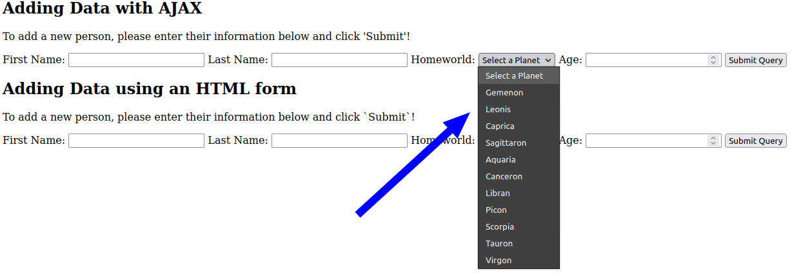
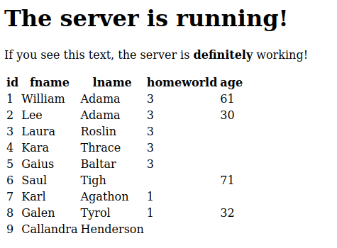
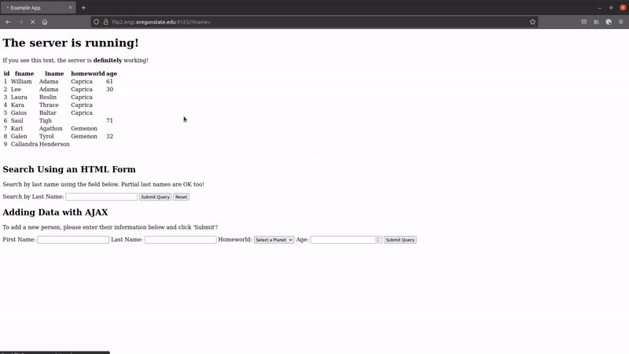

# Node.js - Step 6 - Dynamically Filling Dropdowns and Adding a Search Box

Seems complicated, but really it's the matter of executing one extra query before we render our webpage. This section will show you how to populate a dropdown `<select>` HTML element with meaningful values for Planets instead of just having the user manually type in the ID of the Planet. 

We will also cover adding a search feature to the page so that you can filter the results in your table.

# Dynamic Dropdown

The current state of the project has the user manually entering the Planet ID in for the `Homeworld` field. You don't manually enter the SKU of the product you want to buy at your favorite online retailers, do you? No, you pick the item from a list of meaningful names. 

To faciliate this, we need to get the information to populate the dropdown, add the dropdown to our Handlebars template, and very slightly modify our `app.js`.

## Get the Information Needed for the Dropdown and Modify `app.js`

First thing is first, let's modify the `app.js`. Right now, we only query the `bsg_people` table and those results don't contain the planet names. We need the planet names in order to present them dynamically on the web page.

Modify your `app.get('/')...` function to look like this. We add a second query to get all the planets, and then we call one query as a callback function of the other. The scope of the inner most set of brackets will allow us to access the results of `query1` which are the `bsg_people` results, and `query2` which are the `bsg_planets` results.

Notice, we also added a second property to the `res.render(...)` call at the very end. We pass it two objects, one called `data`, and the new one, `planets`.

```javascript
    // Declare Query 1
    let query1 = "SELECT * FROM bsg_people;";

    // Query 2 is the same in both cases
    let query2 = "SELECT * FROM bsg_planets;";

    // Run the 1st query
    db.pool.query(query1, function(error, rows, fields){
        
        // Save the people
        let people = rows;
        
        // Run the second query
        db.pool.query(query2, (error, rows, fields) => {
            
            // Save the planets
            let planets = rows;
            return res.render('index', {data: people, planets: planets});
        })
```

## Update the Handlebars template

Ok, now that we are passing the correct data to the template engine (Handlebars), we can now use that data to populate a dropdown. Inside your `index.hbs` file, scroll to the section where you created the form to add a new person to the database. It will look like a bunch of `<label>` tags, each followed by `<input>` tags. Delete or comment out the `<input>` tag for the `homeworld` input field. Now replace it with the `<select>` tag below!

```html
    <select name="input-homeworld" id="input-homeworld-ajax">
        <option value="">Select a Planet</option>
        {{#each planets}}
        <option value="{{this.id}}">{{this.name}}</option>
        {{/each}}
    </select>
```

> If you are using AJAX, the `id` field is very important since your DOM manipulation is likely targetting a specific ID. Ensure that your ID of your old `<input>` tag matches the ID of the new `<select>` tag you replace it with.

So what is going on here? The `<select>` tag tells the browser to create a dropdown. The `name` property is important when we are using this tag in conjunction with an HTML form. The `id` property is important for DOM targetting (assuming that's how its being targetted, which we are). You then see two `<option>` tags. These tags are each option that appears in the dropdown. The reason we have two is there is a default one (the first one) with no value, and simply says `Select a Planet`. This will be the the first thing a user sees on the page. It's what UI/UX Designers call a "Call to Action". 

The second `<option>` tag is enclosed in a Handlebars `each` helper. We used this to create the individual rows in the table earlier. We are using it again to create all the different options from the list of Planets we pass in.

The data coming over from our `app.js` looks similar to this (you can `console.log` it and this is what you'd see):

```javascript
[
    {
        id: 1,
        name: "Mars"
    },
    {
        id: 2,
        name: "Earth"
    },
    ...
]
```

This `each` helper iterates through each object in this array we send over and says, "Create an option in my dropdown with a value of `id` and text displayed to the user of `name`.

And that's it!



The beauty of this is, by setting the `value` of each option equal to the ID, when we select a specific planet, that numerical value is used to faciliate the addition of the new person in the database. It's simply abstracted away from the user.

# Search

This is by far the most requested feature demo in this class, period. This, is that.

First, we need to break this problem down into pieces. To make search work, we need to add the relevant field to our web app and we need to have a route (or modify an existing one) to accept requests from that form and perform the relevant query. We are going to create a search box, that allows us to search the database by last name (partial or full) and return only those results.

## Handlebars 

Adding the form is easy, so let's get that out of the way. Open your `index.hbs` and add the following section:

```html
<h2>Search Using an HTML Form</h2>
<p>Search by last name using the field below. Partial last names are OK too!</p>
<form id="search-person-html" method='GET' action='/'>
    <label for="input-lname">Search by Last Name: </label>
    <input type="text" name="lname" id="input-lname-html-search">
    
    <input type="submit">
    <a href='/'><button>Reset</button></a>
</form>
```

What's going on here? Well, the `<h2>` and `<p>` tag are just text displayed on the page.

We create a `<form>` and tell it to use the `GET` method. We also give it an action of `/` since we plan on reusing the root route of our `app.js` file. You can certainly create a new route, if you so choose.

Inside the `<form>` we have a `<label>` which is just text to identify the form input to the user. We have two `<input>` tags: the first is our search text box. The second is a `submit`, which appears as a button.

The key part of the *first* `<input>` is the `name` field. This value will be what we are looking for to come over when when we write the necessary parts in our `app.js` file.

Lastly, there is an `<a>` tag with a `<button>` inside of that. In short, we need a method to 'reset' the table after a search if we want to view all the results again. A button labelled reset makes it clear to the user how to do that, and we just give it a link to the root route, which by default already retrieves all the results.

> We aren't using an `<input>` tag for the reset button because we are not using it as part of the form or data we are submitting.

Ok, at this point, we have what we need on the front-end, let's open the hood, and get this working correctly now. 

## Modifying `app.js`

In an attempt to be efficient with our code here, we are reusing the root route to facilitate search requests as well. 

The trigger for whether we will return all results, or a subset of the results in the database will be an attribute called a **query string**. Have you ever seen a URL that looked like this?

```bash
http://www.oregonstate.com/people?q=first+name
                                 ^
                        Start of Query String
```

When we really don't care about the privacy or sensitivity of data being sent (like search terms), we can use a less-complex GET request to send the data (in this case our search parameter) as a Query String.

In `app.js` we will make that the way we decide which SQL query to run, and then run the appropriate query.

Open up your `app.js` and navigate to the `app.get('/'...)` (root route) handler. Modify it to look as such:

```javascript
app.get('/', function(req, res)
{
    // Declare Query 1
    let query1;

    // If there is no query string, we just perform a basic SELECT
    if (req.query.lname === undefined)
    {
        query1 = "SELECT * FROM bsg_people;";
    }

    // If there is a query string, we assume this is a search, and return desired results
    else
    {
        query1 = `SELECT * FROM bsg_people WHERE lname LIKE "${req.query.lname}%"`
    }

    // Query 2 is the same in both cases
    let query2 = "SELECT * FROM bsg_planets;";

    // Run the 1st query
    db.pool.query(query1, function(error, rows, fields){
        
        // Save the people
        let people = rows;
        
        // Run the second query
        db.pool.query(query2, (error, rows, fields) => {
            
            // Save the planets
            let planets = rows;

            return res.render('index', {data: people, planets: planets});
        })
    })
});
```

This is a bigger chunk of code, so let's break it down.

```javascript
    // Declare Query 1
    let query1;

    // If there is no query string, we just perform a basic SELECT
    if (req.query.lname === undefined)
    {
        query1 = "SELECT * FROM bsg_people;";
    }

    // If there is a query string, we assume this is a search, and return desired results
    else
    {
        query1 = `SELECT * FROM bsg_people WHERE lname LIKE "${req.query.lname}%"`
    }

    // Query 2 is the same in both cases
    let query2 = "SELECT * FROM bsg_planets;";
```

In total, we will need to run two queries. One for `bsg_people` the other for `bsg_planets` (which is required to populate the dropdown).

For a search function, we need to manipulate the results of `bsg_people` by limiting it in some manner according to our passed in string. As stated before, we will use the query string. Specifically, we will look for the value `lname`

> If this is not working for you, make sure you set the `name` property, of the `<input>` tag for the search text box to `lname`.

If it is not defined, we can assume this is either a user's first visit to the page, in which we want to present all results to them, or, they hit the `reset` button in the search form and would like all results from the database as a result.

However, if it *is* defined, we need to modify the results we give to the user by requesting a different set of data from the database. We use a template literal to insert whatever the user typed in the search field plus a `%` character in the `LIKE` qualifier of the SQL command in the `else` brackets.

> In the "real world" this implementation is horribly unsafe and can subject applications to SQL injection attacks. Production code would never do this. However, this is perfectly acceptable here since topics like input sanitatization and validation are outside the scope of the project requirements. End of rant.

`query2` remains the same in both cases so we can assign that outside the `if` statement.

```javascript
    // Run the 1st query
    db.pool.query(query1, function(error, rows, fields){
        
        // Save the people
        let people = rows;
        
        // Run the second query
        db.pool.query(query2, (error, rows, fields) => {
            
            // Save the planets
            let planets = rows;
```

Here we run both queries, one as the callback function of the next. We save the results (`rows`) of each, as meaninful variable names.

```javascript
            return res.render('index', {data: people, planets: planets});
```

And then we return, the data, just as before! We can save everything, go back to our web page to test it out!


# Bonus - Dynamically Expressing ID's as Names (Data Conversion)

So right now, the output of our table looks something like this:



Notice, the `homeworld` column displays its values as the Planet's `id`. What is planet 3? What is planet 1? This isn't very helpful. Imagine, going to your favorite online retailer, and scrolling through a list of product ID's or SKUs. Exactly. Let's fix that.

This can be achieved in a variety of ways. You can do it skillfully with an `SQL JOIN` statement. That would work, and would be efficient because you only have to run a single query. You can do it with AJAX after the page renders, its a bit more costly because it requires at least 2 requests to achieve. You can do it in the Handlebars renderer by adding a custom helper function. We are going to do it with plain old JavaScript in our `app.js`.

We need to make a very slight, but somewhat technical addition to our `app.js`. The code we will be adding will come in our root route, right after `let planets = rows`.

```javascript
        // Run the second query
        db.pool.query(query2, (error, rows, fields) => {
            
            // Save the planets
            let planets = rows; 

            // BEGINNING OF NEW CODE

            // Construct an object for reference in the table
            // Array.map is awesome for doing something with each
            // element of an array.
            let planetmap = {}
            planets.map(planet => {
                let id = parseInt(planet.id, 10);

                planetmap[id] = planet["name"];
            })

            // Overwrite the homeworld ID with the name of the planet in the people object
            people = people.map(person => {
                return Object.assign(person, {homeworld: planetmap[person.homeworld]})
            })

            // END OF NEW CODE

            return res.render('index', {data: people, planets: planets});
        })
```

Ok, wow, arrow functions, a map function, we're getting a bit technical now. 

In JavaScript, `Array.map` is a function. For any array, if you call the `map` function on it, it will iterate through every member of the array, in order, and do whatever you want with each member. This is an AWESOME function, but for beginners, it can be quite daunting to understand. `Array.map` returns a new Array. If you are creating a new Array, you must `return` the value you want placed in the new Array. If you are manipulating something else and just using the values from the array, you don't need to return anything.

> I'm using arrow notation here, again, not hard stuff, but daunting if you don't know what you are looking at. Just know that it works like this:
>```javascript
> variable => { function }
> // variable is an argument passed to the function
> // function is what you do with that variable
>
> // you can pass more than one variable in like this
> (var1, var2, var3) => { function }
>```
> Arrow functions are regular functions that just are not named. Same thing as lambdas in Python.

`planets.map` populates the empty object `planetmap`. Here is exactly what it is doing; It is turning data like this:

```javascript
[
    {
        id: 1,
        name: "Mars"
    },
    {
        id: 13,
        name: "Pluto"
    },
    ...
]
```
Into data like this
```javascript
{
    1: "Mars",
    13: "Pluto"
}
```

`people.map` is now using that `planetmap` object we just created in the first function, to overwrite the `homeworld` value, for every person in the `people` array with the `name` of the Planet. It does this by taking the old `homeworld` value, and looking up that key in `peoplemap` and replacing the `homeworld` value for each person with the mapped value for that planet, the `name`.

Once you make this change, go back to your web application after restarting the web server. Let's check it out now!


There we go! Now, the data displayed in our table is more meaningful. 

# Wrap-up

At this point, you should have developed a fairly comfortable handle using these techniques and implementing them. This is merely an overview though. The biggest piece of advice I can give you is to try something, test it, see if it works, if it does, try to break it, and if it doesn't break, move on and learn more!

We added drop-down menus that are dynamically populated, we added a search function to our page, and as a bonus, we replaced opaque `ids` of Planets with their actual names. And the end result is definitely an improvement for the user and their experience.

